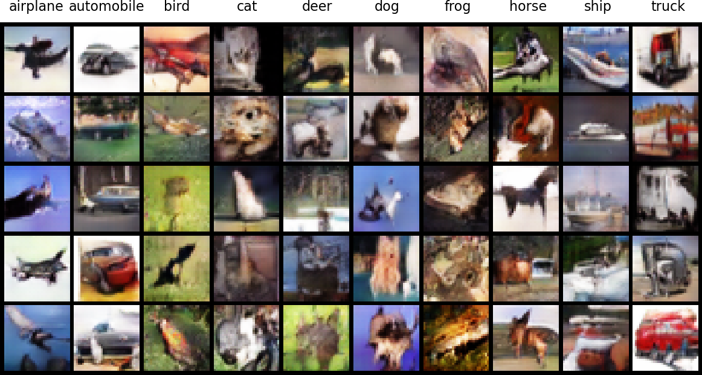

# pilot-GAN
## About
Pilot project of CIFAR-10 image generation by conditional DCGAN [^1] [^2].

## Directories & Files
- `C-DCGAN_original` (main): Conditional DCGAN
- `C-GAN-Color`: C-GAN for color images
- `DCGAN_PyTorch`: Deep Convolutional GAN (DCGAN) for monochrome image
- `C-GAN_PyTorch`: Conditional GAN for monochrome image
- `chap05`: Sample codes of text book. Downloaded from [here](https://www.shuwasystem.co.jp/support/7980html/6464.html)
- `gif.py`: Codes to create gif animation of results.

## References
[^1]: チーム・カルポ著. *物体検出とGAN、オートエンコーダー、画像処理入門: PyTorch/TensorFlow2による発展的・実装ディープラーニング*. Tōkyō: 秀和システム, 2021.

[^2]: Radford, Alec, Luke Metz, and Soumith Chintala. “Unsupervised Representation Learning with Deep Convolutional Generative Adversarial Networks,” January 7, 2016. http://arxiv.org/abs/1511.06434.

